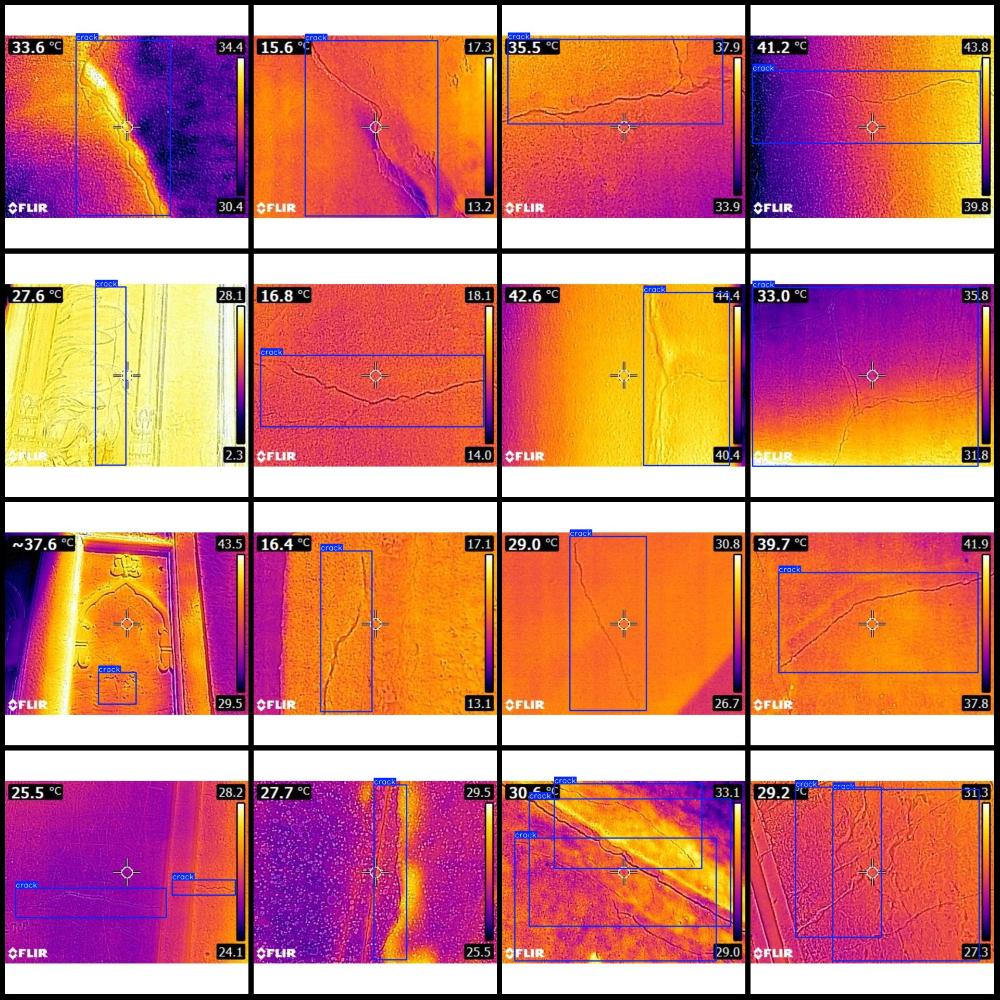
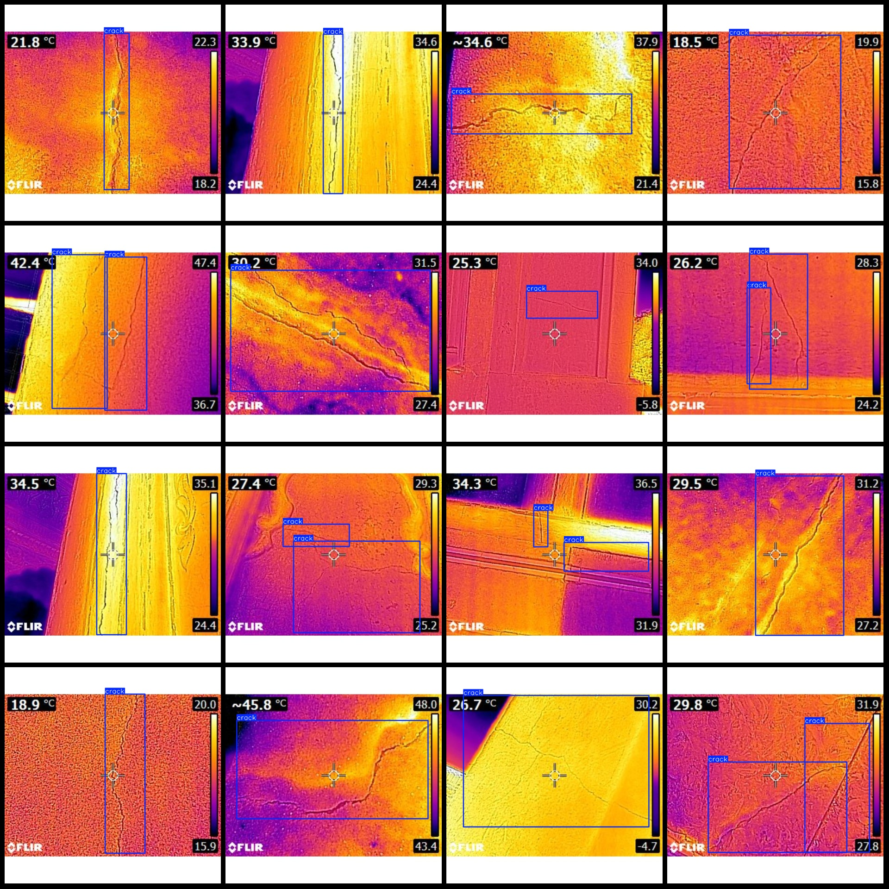

# Intelligent Building Infrared Thermal Imaging Wall Cracks Detection Dataset VOC+YOLO Format - 700 Images in 1 Category

Dataset Format: Pascal VOC format + YOLO format (txt file without segmentation paths, only containing jpg images and corresponding VOC format xml files and yolo format txt files)
Number of Images (jpg file count): 700
Number of Annotations (xml file count): 700
Number of Annotations (txt file count): 700
Number of Annotation Categories: 1
Annotation Category Name: ["crack"]
Number of Boxes per Category:
crack = 806
Total Boxes: 806
Number of Images per Category:
crack = 700
Image Resolution: 640x640
Annotation Tool: labelImg
Annotation Rules: Drawing a box around the category
Important Notice: The dataset does not include training/validation/test splits; you will need to divide it yourself.
Special Notice: This dataset does not guarantee the accuracy of the trained models or weights file.
Preview of Images:
Example of Annotation:

## Images

Here is a pay link on Stripe ( https://buy.stripe.com/3cs8yP7sY87d0vu9AB ). Please contact me lonlonago@foxmail.com after funding $89, and I will send you a complete data files , thank you!

